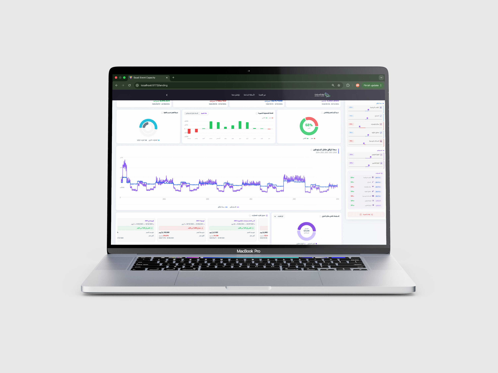

<div align="center">

# National Observatory for Major Events Facilities Readiness 📊
### المرصد الوطني لجاهزية مرافق الفعاليات الكبرى 📊
<p>
  
  &nbsp;
  
  &nbsp;
  
  &nbsp;
  
</p>

A national platform for measuring infrastructure **readiness and capacity** for Saudi Arabia's major upcoming events, providing daily deficit/surplus analysis, scenario simulation, and strategic planning support across the **2030–2034** event horizon.

[🌐 Visit the Website ](https://saudi-events-capacity.vercel.app/)

</div>

---

<div align="center">
  
</div>

<p align="center">
  
  
  
</p>

---

## 📌 About The Project

Saudi Arabia is entering a landmark decade, hosting some of the world's largest events including **Expo 2030**, **FIFA World Cup 2034**, the **Esports World Cup**, **Formula E & F1**, **Riyadh Season**, and more. Ensuring infrastructure readiness at this scale demands data-driven capacity planning.

The **National Observatory for Major Events Readiness** addresses this need through a centralized dashboard that:

- Tracks daily facility capacity against projected local and international visitor volumes
- Identifies **capacity gaps (deficit)** and **excess capacity (surplus)** across all infrastructure types
- Enables planners to run **"What-if?" scenario simulations** with real-time chart updates
- Covers every day from 2030 to 2034, mapped against all active events and seasons

---

### ✨ Key Features

| Feature | Description |
|:--|:--|
| **Daily Capacity Gap Analysis** | Compares targeted visitor numbers (local + international) against facility capacity, computing deficit or surplus per day |
| **What-If? Scenario Tool** | Adjust facility capacity or visitor volumes and see all KPIs and charts update instantly |
| **Event Timeline Mapping** | Every day is automatically tagged to its active events (Expo 2030, World Cup 2034, Formula E/F1, Riyadh Season, Soundstorm, FII, Esports World Cup, and more) |
| **Extreme Period Detection** | Automatically identifies the longest consecutive peak deficit or surplus period |

---

## 🏆 Coverage & Scope

| Dimension | Details |
|:--|:--|
| **Time Horizon** | 2030 – 2034 (daily granularity) |
| **Facilities Breakdown** | Sports Stadiums · Theaters · Conference Centers · Entertainment Zones · Seasonal Squares |
| **Visitor Breakdown** | Local visitors · International visitors |
| **Analysis Type** | Capacity deficit · Capacity surplus · Coverage % · Scenario simulation |

---

## 🛠️ Built With

<p align="center">
  
  
  
  
  
</p>

| Layer | Technology | Role |
|:--|:--|:--|
| **Frontend** | React.js, JavaScript, CSS | RTL dashboard UI, KPI cards, interactive filters |
| **Data Visualization** | Recharts | Composed charts, bar charts, pie charts, radial bar charts, reference areas |
| **Data Loading** | Fetch API + parallel year files | Split JSON files loaded in parallel for performance |
| **Export** | SheetJS (xlsx) | One-click Excel export of full dataset |
| **Icons** | React Icons (Fi + Md + Fa) | Dashboard icons across all UI components |

---

## 🏗️ Architecture

```
┌──────────────────────────────────────────────────────────────┐
│                     Frontend (React.js)                      │
│   Landing Page · Capacity Dashboard · What-If? Simulator     │
└──────────────────────────┬───────────────────────────────────┘
                           │
           ┌───────────────▼───────────────┐
           │         Analysis Engine       │
           │  ┌────────────────────────┐   │
           │  │  Deficit / Surplus     │   │
           │  │  Gap Calculator        │   │
           │  └────────────────────────┘   │
           │  ┌────────────────────────┐   │
           │  │  Extreme Period        │   │
           │  │  Detector              │   │
           │  └────────────────────────┘   │
           │  ┌────────────────────────┐   │
           │  │  Event Timeline        │   │
           │  │  Mapper (2030–2034)    │   │
           │  └────────────────────────┘   │
           └───────────────┬───────────────┘
                           │
          ┌────────────────▼────────────────┐
          │           Data Layer            │
          │        Multi 'json' files       │
          │       simulated/dummy data      │
          └─────────────────────────────────┘
```

---

<div align="center">

&nbsp;

&nbsp;

&nbsp;

</div>
